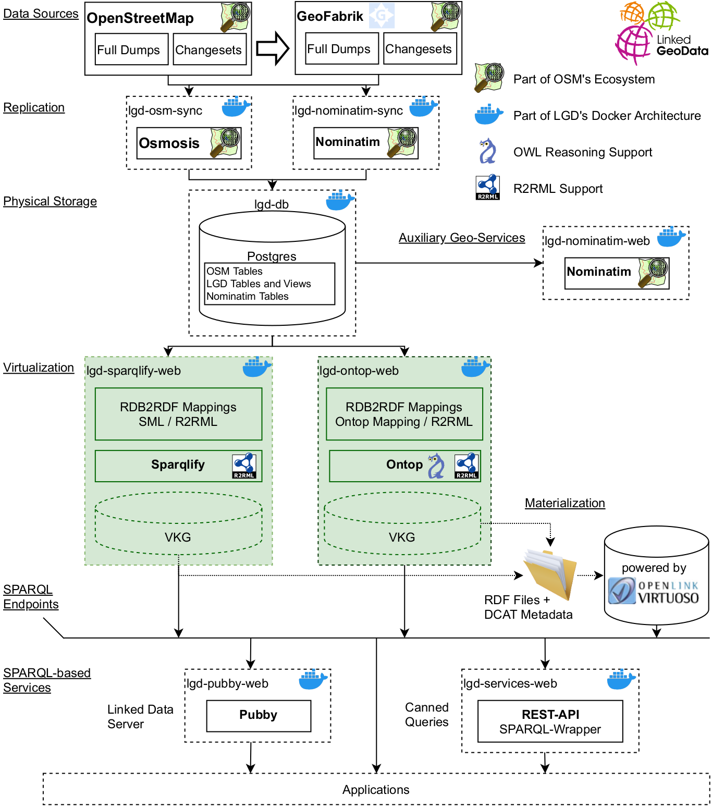

## Welcome to LinkedGeoData: Providing OpenStreetMap data as RDF
LinkedGeoData (LGD) is an effort to add a spatial dimension to the Web of Data / Semantic Web. LinkedGeoData uses the information collected by the OpenStreetMap project and makes it available as an RDF knowledge base according to the Linked Data principles. It interlinks this data with other knowledge bases in the Linking Open Data initiative.

The project web site can be found [here](http://linkedgeodata.org).
If you are running [Ubuntu](http://www.ubuntu.com) then this repository contains everything you need to transform OpenStreetMap data to RDF yourself.
For other systems please consider contributing adaptions of the existing scripts.

### Quick Start

The following commands should get you started with a running Monaco dataset:
```bash
make
cd lgd-docker
docker-compose up
```

Services will run under these ports:

* Nominatim: http://localhost:8012/
* Sparqlify: http://localhost:8013/sparql
* Ontop: http://localhost:8014/
* Pubby: http://localhost8021/

### Important Notes
* The default settings are in [lgd-docker/env.dist](lgd-docker/env.dist).
* If the file `lgd-docker/.env`. does not exist then the `make` invocation will also create it from `env.dist`.
* Most configuration changes, such as port and database settings, take effect when restarting the containers.
* Many data and config files are stored in volumes whose naming is `${parent-directory}_${service-name}-vol`. For example `lgd-docker_lgd-osmosis-sync-vol`. You can check existing volumes with `docker volume ls`.
* Before starting the containers the sources for the initial data and incremental updates can be configured. These settings should not be changed after starting the containers.


### Contributions Welcome
The docker-based architecture is aimed at making it easy to contribute new or alternative components that can sit side-by-side with the core of the system - which
is the a virtual knowledge graph view over an OSM database.
Please open issues for discussion.

Examples include but are not limited to:

* A more modern Linked Data Interface that displays GeoSPARQL geometries out-of-the-box
* Nicer SPARQL interface (YASGUI)
* Another data virtualization engine in order to ease comparision with the already integrated ones
* Updates to the existing OSM-RDF mappings, proposals about how this system could be improved.
* Proposals for a better IRI schema. For example, the 'triplify' in the IRIs is archaic. Migration to the pattern used by [Sophox](https://wiki.openstreetmap.org/wiki/Sophox) seems very worthwhile. Because of the virtual knowledge graph approach there should be no problem to use the legacy approach in parallel.
* General proposals for architecture improvements (e.g. config options in the docker setup to improve modularity)

Dockerfiles for services such as a Linked Data or SPARQL interfaces should be designed to allow configuration of the target SPARQL endpoint(s), ideally via the docker environment.

### How It Works

The architecture shown in the image below. The docker setup is located in the [linkedgeodata-docker](linkedgeodata-docker) folder.



* This project first uses Osmosis to initialize a 'raw' OpenStreetMap postgis database (using simple schema) from a `.osm.pdf` file.
* Then, this database is extended with additional tables containing RDF mapping - and interlinking - information. Also, helper views are provided for simplifying access to the integrated information.
* Further, a nominatim setup (based on osm2pgqsl) is performed to further enrich the initial database osm data.
* A set of RDB2RDF mappings is provided that enables running SPARQL queries over the postgis database. The SPARQL-2-SQL rewriting engine we use is Sparqlify.
* Dumps are generated by simply running preconfigured SPARQL queries.


### Debian package now available!
Technically, LinkedGeoData is set of SQL files, database-to-rdf (RDB2RDF) mappings, and bash scripts.
The actual RDF conversion is carried out by the SPARQL-to-SQL rewriter [Sparqlify](https://github.com/AKSW/Sparqlify).
You can [view the Sparqlify Mappings for LinkedGeoData here](https://raw.github.com/GeoKnow/LinkedGeoData/master/linkedgeodata-core/src/main/resources/org/aksw/linkedgeodata/sml/LinkedGeoData-Triplify-IndividualViews.sml).
Therefore, if you want to install the LinkedGeoData debian package, you also  Sparqlify one.

For the latest version of LinkedGeoData package, perform the following steps to set up the package source:

Register the repo

    echo 'deb http://cstadler.aksw.org/repos/apt precise main contrib non-free' | sudo tee /etc/apt/sources.list.d/cstadler.aksw.org.list

Import the public key

    wget -qO - http://cstadler.aksw.org/repos/apt/conf/packages.precise.gpg.key  | sudo apt-key add -

Now you can install LinkedGeoData using

    sudo apt-get update
    sudo apt-get install linkedgeodata


You can download and install packages manually, however installing their dependencies requires more work:
* [sparqlify-cli Debian Package](http://cstadler.aksw.org/repos/apt/pool/main/s/sparqlify-cli/)
* [linkedgeodata-nominatim Debian Package](http://cstadler.aksw.org/repos/apt/pool/main/l/linkedgeodata-nominatim-v2.5.1/)
* [linkedgeodata Debian Package](http://cstadler.aksw.org/repos/apt/pool/main/l/linkedgeodata/)


After installing these packages, the following essential commands will be available:
* `lgd-createdb` (provided by linkedgeodata) - Sets up a complete database ready for subsequent RDF conversion
* `lgd-createdb-snapshot` (provided by linkedgeodata) - Same as above, however using a different schema (experimental; not recommended)
* `sparqlify-tool` (provided by sparqlify) - Runs SPARQL queries on a relational (LGD) database
* Have a look at the [section for additional tools](#additional-tools)

Read the section on data conversion for their documentation.

### Alternative set up
In [/bin](https://github.com/GeoKnow/LinkedGeoData/tree/master/linkedgeodata-cli/bin) you find the following setup helper scripts which are aimed at easing the LinkedGeoData setup directly from source; without a debian package:

* `[lgd-apt-install-ubuntu-16.04.sh](linkedgeodata-cli/bin/lgd-apt-install-ubuntu-16.04.sh)`: Installs all required system packages using apt (postgres, postgis, java, and several dependencies required for (building) nominatim)

The following scripts are just helpers to build and/or install the Sparqlify debian package. Mainly intended for development.

* `lgd-build-and-install-dependencies.sh`: Builds a Sparqlify debian package from source and installs it.
* `lgd-download-and-install-dependecies.sh`: Simply downloads and installs the latest Sparqlify debian package.


### Do it yourself data conversion
This section describes how to create and query a LinkedGeoData database. After you installed the LinkedGeoData scripts, you need to obtain an OpenStreetMap dataset which you want to load.
Note: Make sure to read the section on database tuning when dealing with larger datasets!

As for obtaining datasets, a very good source for OSM datasets in bite-size chunks is [GeoFabrik](http://download.geofabrik.de). For full dumps, refer to the [planet downloads](http://planet.openstreetmap.org/).

In [/bin](https://github.com/GeoKnow/LinkedGeoData/tree/master/linkedgeodata-cli/bin) you find several scripts. Essentially they are designed to work both from a cloned LinkedGeoData Git repo and wrapped up as a debian package.
All of them are configured via `lgd.conf.dist`. You can override the default settings without changing this file by creating a `lgd.conf` file.
If you installed the debian package, instead of the lgd.conf.dist file, the file /etc/sparqlify/sparqlify.conf` is used.
If you are using the following scripts from the git repo, invoke them with `./scriptname.sh` (i.e. don't forget the `./` and `.sh`).

* (`lgd-createdb-snapshot`: An experimental, but possibly much faster, version of the `lgd-createdb` script. Probably the `lgd-createdb` command will eventually refer to this version.)

* `lgd-createdb`: Creates and loads an LGD database
  * -h  postgres host name
  * -d  postgres database name
  * -U  postgres user name
  * -W  postgres password (will be added to ~/.pgpass if not exists)
  * -f  .pbf file to load (other formats currently not supported)

Example:

    wget http://download.geofabrik.de/europe/monaco-latest.osm.pbf
    lgd-createdb -h localhost -d lgd -U postgres -W mypwd -f monaco-latest.osm.pbf

The reason we chose Monaco for the example is simply that it is a small file (> 10MB).


* `sparqlify-tool`: This is a small wrapper for `sparqlify` command that adds a simple profile system for convenience.
  * -P  profile name. Settings will be loaded from such a file (see below) and can be overridden by further options.
  * -h  database host name
  * -d  database name
  * -U  database user name
  * -W  database password (will be added to ~/.pgpass if not exists)
  * -Q  SPARQL query string or named query


Here is an example of a profile file, which is assumed to be located at `/etc/sparqlify/profiles.d/lgd-example.conf`.
This file will be deployed when installing the linkedgeodata debian package.

        dbHost="localhost"
        dbName="lgd"
        dbUser="postgres"
        dbPass="postgres"
        mappingFile="/usr/share/linkedgeodata/sml/LinkedGeoData-Triplify-IndividualViews.sml /usr/share/linkedgeodata/sml/LinkedGeoData-Nominatim.sml"


A named query is just a SPARQL query that is referenced by a name.
The mapping of a name to a SPARQL is configured via `/etc/sparqlify/sparqlify.conf`.

Currently, the following named queries exist:

* `ontology`: Creates an N-Triple output with all classes and properties
* `dump`: Create a full dump of the database

Examples:

        sparqlify-tool -P lgd-example ontology
        sparqlify-tool -P lgd-example dump
        sparqlify-tool -h localhost -d lgd -U postgres -W mypwd -Q 'Construct { ?s ?p ?o } { ?s a <http://linkedgeodata.org/ontology/Pub> . ?s ?p ?o }'
        sparqlify-tool -P lgd-example -Q 'Select * { ?s ?p ?o . Filter(?s = <http://linkedgeodata.org/triplify/node2028098486>) }'

Again, note that Sparqlify is still in development and the supported features are a bit limited right now - still, basic graph patterns and equal-constraints should be working fine.


### Additional tools

* `lgd-osm-replicate-sequences`: Convert a timestamp to a sequence ID. This is similar to [mazdermind's replicate sequences tool](https://github.com/MaZderMind/replicate-sequences), however, our version does not require a local index. Instead, our tools combines binary search with linear interpolation: First, the the two most recent state.txt files from the given repository url are fetched, then the time differnce is computed, and based on linear interpolation a sequence id close to the given timetstamp is computed. This process is repeated recursively.
```bash
lgd-osm-replicate-sequences -u "http://planet.openstreetmap.org/replication/hour/" -t "2017-05-28T15:00:00Z"

# The above command from the debian package is a wrapper for:

java -cp linkedgeodata-debian/target/linkedgeodata-debian-*-jar-with-dependencies.jar \
    "org.aksw.linkedgeodata.cli.command.osm.CommandOsmReplicateSequences" \
    -u "http://planet.openstreetmap.org/replication/hour/" -t "2017-05-28T15:00:00Z"
```
The output is a (presently subset) of the appropriate state.txt file whose timestamp is strictly less than that given as the argument.
```
sequenceNumber=41263
timestamp=2017-05-28T14\:00\:00Z
```
Note, that the timestamp format is compatible with `osmconvert`, which can check for the most recent data item in a osm data file. Hence,
these tools can be combined in order to find the state.txt file from which to proceed with replication.
```bash
timestamp=`osmconvert --out-timestamp "data.osm.pbf"`
lgd-osm-replicate-sequences -u "url-to-repo" -t "$timestamp"
```

```bash
# Use the -d option to option the (d)uration between the most recently published files
lgd-osm-replicate-sequences -u "http://planet.openstreetmap.org/replication/day/" -d
# This yields simply the output (possibly off by a few seconds)
# 86400
```

### Postgresql Database Tuning
It is recommended to tune the database according to [these recommendations](http://wiki.postgresql.org/wiki/Tuning_Your_PostgreSQL_Server). Here is a brief summary:
Edit `/etc/postgresql/9.1/main/postgresql.conf` and set the following properties:

        shared_buffers       = 2GB #recommended values between 25% - 40% of available RAM, setting assumes 8GB RAM
        effective_cache_size = 4GB #recommended values between 50% - 75% of available RAM, setting assumes 8GB RAM
        checkpoint_segments  = 256
        checkpoint_completion_target = 0.9
        autovacuum = off # This can be re-enabled once loading has completed

        work_mem             = 256MB (This memory is used for sorting, so each user may use this amount of memory for his sorts; You may want to use a significantly lower value if there are many connections doing sorts)
        maintainance_work_mem = 256MB


Furthermore, allow more shared memory, otherwise postgres won't start:
Append the following line to `/etc/sysctl.conf`:

        #Use more shared memory max
        kernel.shmmax=4294967296

        # Note: The amount (specified in bytes) for kernel.shmmax must be greater than the shared_buffers settings obove
        #4GB = 4294967296
        #8GB = 8589934592

Make the changes take effect:

        sudo sysctl -p
        sudo service postgresql restart


## Project layout

This project requires Make and Apache Maven to build (Java 11+ required).
Maven builds are not dockerized. Therefore any built artifacts will be cached in the local repository as usual.

### Primary resources
They include the SQL files and mappings that enable rewriting SPARQL queries to SQL ones over an OpenStreetMap (and Nominatim) database.
Furthermore, bash scripts are avaiable for helping setting up an LGD database.
The mavenization and dockerization re-package these resources.

The following folders contain resources that are copied when building the `lgd-tools-resources` jar bundle
* [sql](sql) SQL scripts for extending on OSM simple schema database
* [sml](sml) The mapping files in SML format. Convert to e.g. r2rml using the mapping converter.

The scripts in the bin folder become part of the debian packaging of the cli tools `lgd-tools-pkg-deb-cli`
* [bin](bin) Bash scripts for setting LinkedGeoData up (Ubuntu)


### Thirdparty resources

There is a pom.xml that creates a jar file from a snapshot of the nominatim git.
Especially for development this is much faster than repeated clones of the full git repo.


Modules under lgd-pkg-parent lgd-pkg-\* are packaging setups independent of the parent pom.xml!

## License
The content of this project are licensed under the [GPL v3 License](https://github.com/GeoKnow/LinkedGeoData/blob/master/LICENSE).

